# FinOptica Enterprise AI FinOps Blueprint

## 1) Product Analysis

### Product vision
FinOptica becomes an AI-first multi-cloud FinOps control tower that turns billing data, infra telemetry, and SaaS usage into prioritized, low-risk savings actions with measurable ROI.

### Personas
- **CFO / Finance Director**: budget guardrails, forecast confidence, executive reporting.
- **Head of Platform / SRE Manager**: operational risk, remediation effort, deployment safety.
- **FinOps Lead**: savings plan coverage, anomaly triage, unit economics by team/product.
- **Cloud Engineer / DevOps**: validated Terraform/CLI patches, rollback automation.
- **Security/Compliance**: tenant isolation, auditability, policy enforcement.

### Core use cases
- Multi-source ingestion: CUR, Azure Cost, GCP Billing export, K8s metrics, Datadog, OpenAI usage.
- Waste detection: idle, rightsizing, orphan storage/snapshots, anomaly spikes.
- Action generation: Terraform/CLI/Kubectl + dry-run + rollback.
- Conversational FinOps copilot with RAG and evidence-backed recommendations.
- Executive and technical reporting with confidence score and operational risk.

### Business model
- **SaaS tiers**: Starter (single-cloud), Growth (multi-cloud + K8s), Enterprise (SSO/SCIM, private VPC, advanced policy).
- **Pricing dimensions**: managed spend under analysis + connector count + AI action volume.
- **Services upsell**: FinOps onboarding packs, policy-as-code baseline, custom connectors.

### Market differentiation
- Agentic remediation engine with built-in rollback and risk scoring.
- FinOps + GreenOps + AI workload optimization in one workflow.
- Tenant-aware recommendations with explainability and evidence trails.

### Competitive mapping (condensed)
| Platform | Strength | Gap FinOptica can exploit |
|---|---|---|
| Apptio / Cloudability | Mature reporting and governance | Slower AI-native action loops |
| Kubecost | Strong K8s cost visibility | Limited enterprise multi-domain AI copilot |
| Spot / Harness | Strong compute optimization | Broader cross-SaaS + billing intelligence opportunity |
| Datadog / New Relic | Great observability context | Cost remediation automation less central |

### MVP vs Enterprise
- **MVP (0-3 months)**: multi-cloud billing ingestion, anomaly detection, recommendation center, basic copilot.
- **Enterprise (4-12 months)**: SSO/SCIM, policy engine, workflow approvals, private deployment, advanced forecast models, benchmark intelligence.

---

## 2) Enterprise Architecture

```mermaid
flowchart LR
  subgraph Sources[Data Sources]
    AWS[AWS CUR/Cost Explorer]
    AZ[Azure Cost Mgmt]
    GCP[GCP Billing Export]
    K8S[Kubernetes Metrics]
    OBS[Datadog/NewRelic/Prometheus]
    SAAS[OpenAI/GitHub Actions/SaaS APIs]
    FILES[PDF/CSV/XLSX Uploads]
  end

  subgraph Ingestion[Ingestion Plane]
    CONN[Connector Workers]
    BUS[(Event Bus: Kafka/NATS)]
    PARSE[Document/Schema Parsers]
    DQ[Data Quality + Normalization]
  end

  subgraph Data[Data Platform]
    OLTP[(PostgreSQL Multi-tenant)]
    DWH[(Snowflake/BigQuery optional)]
    VDB[(Vector DB for RAG)]
    CACHE[(Redis Cache)]
  end

  subgraph Core[FinOps Core Services]
    API[API Gateway]
    IAM[AuthN/AuthZ + RBAC]
    BILL[Billing Intelligence]
    OPT[Optimization Engine]
    DETECT[Anomaly + Forecast Engine]
    AUTO[Automation Orchestrator]
    REP[Reporting Service]
    COP[AI Copilot + RAG]
  end

  subgraph Delivery[Delivery]
    UI[Web Console]
    ALERTS[Slack/Email/Webhook]
    GIT[GitHub PR Automation]
  end

  Sources --> Ingestion
  Ingestion --> Data
  Data --> Core
  Core --> Delivery
```

### Architecture patterns
- **Microservices**: ingestion, analytics, optimizer, automation, copilot, reporting.
- **Event-driven**: ingestion/sync/recommendation lifecycle events on bus.
- **CQRS**: write models for scans/actions, read models for dashboards and reports.
- **Hexagonal**: adapters for connectors, domain services for FinOps logic.
- **Multi-tenant**: strict tenant scoping on every query and token claims.
- **Zero Trust**: mTLS east-west, least privilege IAM, short-lived credentials.

### HA/DR
- Active-active API across zones; async workers autoscaled by queue lag.
- PITR on PostgreSQL, object storage versioning, immutable audit logs.
- RTO target 30m, RPO target 5m for enterprise tier.

---

## 3) Recommended Technology Stack (Target)

| Layer | Choice | Why |
|---|---|---|
| API Backend | FastAPI + SQLAlchemy + Pydantic | Strong current base, high productivity, type-safe API contracts |
| Async Workers | Celery/Arq + Redis/Kafka | Reliable background ingestion/remediation jobs |
| DB | PostgreSQL | Tenant isolation, strong indexing, analytics-ready extensions |
| Vector DB | pgvector or Qdrant | RAG retrieval with manageable ops |
| Frontend | React + TypeScript + TanStack Query | Scalable enterprise UX and state management |
| Workflow | Temporal or Argo Workflows | Durable long-running remediation flows |
| IaC | Terraform + Helm + ArgoCD | GitOps-friendly, multi-cloud repeatability |
| Auth | OIDC (Auth0/Keycloak/Azure AD) | Enterprise SSO and role federation |
| Observability | OpenTelemetry + Prometheus + Grafana + Loki | Unified SLI/SLO and traces/logs/metrics |
| CI/CD | GitHub Actions + OPA checks + Trivy | Security gates and policy-as-code |

---

## 4) AI/ML Architecture

### AI engines
- **RAG**: FinOps policy docs, cloud pricing docs, internal runbooks, historical remediations.
- **Classification**: tag recommendations by category (rightsizing, RI/SP, storage, GPU).
- **Anomaly detection**: seasonal + robust z-score + service-level drift.
- **Forecasting**: Prophet/ARIMA baseline, gradient boosting for enterprise datasets.
- **Reasoning agents**: planner, evidence retriever, script generator, risk reviewer.

### Guardrails
- Prompt templates force evidence citation and confidence scoring.
- Policy engine blocks destructive scripts without approval.
- Hallucination controls: retrieval-required responses for factual claims.

---

## 5) Connectors Blueprint (Pattern)

Each connector follows the same contract:
- **Auth adapter**: IAM role / service principal / API key from secret manager.
- **Pull scheduler**: incremental windows with checkpoint cursor.
- **Normalizer**: map source schema to canonical `cost_items`.
- **Resilience**: retry with exponential backoff + jitter, idempotent writes.
- **Rate limits**: token bucket per connector + per-tenant quotas.
- **Cache**: short TTL cache for reference metadata.

Mandatory connectors in delivery plan:
- AWS CUR, Azure Cost Mgmt, GCP Billing Export, Kubernetes metrics.
- Datadog, Prometheus, Snowflake usage, OpenAI billing, GitHub Actions usage.

---

## 6) FinOps Recommendation Model

Recommendation output schema:
- `financial_impact_monthly`
- `confidence_score`
- `operational_risk`
- `remediation_effort`
- `estimated_implementation_time`
- `rollback_available`
- `script_bundle` (terraform/bash/cli/kubectl)

Scoring formula (reference):
- `priority_score = impact_weight * savings + confidence_weight * confidence - risk_weight * risk`

---

## 7) Automation & Safety

Execution pipeline:
1. Generate remediation scripts from recommendation context.
2. Run static validation + policy checks.
3. Run dry-run (`terraform plan`, `kubectl diff`, cloud CLI simulate).
4. Execute with scoped credentials.
5. Verify post-change KPIs.
6. Keep rollback artifact and audit record.

---

## 8) UX/UI Modules

- Executive dashboard (spend, savings, forecast, anomaly trend, ROI).
- Technical dashboard (service/resource drill-down, K8s efficiency, action queue).
- Cost explorer with chargeback/showback dimensions.
- AI assistant panel with explainable recommendations and one-click workflows.

---

## 9) Security & Compliance Baseline

- Zero Trust service-to-service auth and tenant boundary checks.
- Encryption at rest/in transit, KMS-backed keys, secret rotation.
- RBAC + scoped automation credentials.
- Full audit trails on login, recommendation actions, remediations.
- Compliance controls mapped to SOC2, ISO27001, GDPR principles.

---

## 10) DevOps / Platform

- GitOps deployment model with environment promotion.
- Blue/green + canary release policies for core services.
- SLOs for API latency, ingestion freshness, recommendation SLA.
- FinOps-specific synthetic tests (billing sync, anomaly trigger, rollback integrity).

---

## 11) Code Delivery Plan (Next Sprints)

### Sprint A (in progress)
- Hardened auth context with signed tokens and RBAC checks.
- Tenant-aware API dependencies across billing/optimization/copilot.
- Configurable CORS and environment-based credentials.

### Sprint B
- Introduce connector worker framework + job table + retry engine.
- Add report generation service and persistence.
- Add API contract tests and CI quality gates.

### Sprint C
- Introduce React frontend migration and modular dashboard architecture.
- Add policy approval workflow for high-risk remediations.
- Add forecasting and benchmark datasets.

---

## 12) AI Report Templates

### Executive report
- Potential savings by horizon (30/90/365 days)
- Top anomalies and financial risk exposure
- Forecast variance and confidence interval
- ROI pipeline and realized savings trend

### Technical report
- Affected resources and dependency map
- Generated scripts and validation outputs
- Risk rating + rollback evidence
- Recommended rollout order by blast radius

---

## 13) Agile Backlog (Epics)

- **Epic 1**: Multi-cloud ingestion reliability
- **Epic 2**: Recommendation quality and explainability
- **Epic 3**: Safe remediation automation
- **Epic 4**: AI copilot with enterprise guardrails
- **Epic 5**: Security/compliance and tenant governance
- **Epic 6**: Executive analytics and reporting

